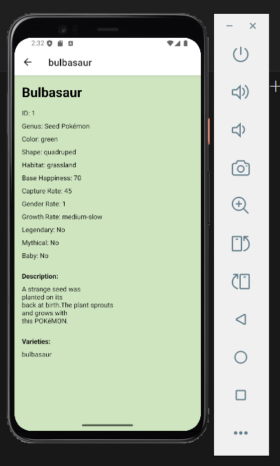

# Pokémon Explorer App

A simple React Native mobile app that displays Pokémon information using data from the PokeAPI.

This project was built to practice mobile app development, API integration, and navigation in React Native.

---

## Features

- Displays a list of Pokémon with images and types  
- Dynamic background color based on Pokémon type  
- Tap a Pokémon to view detailed information  
- Shows species details such as:
  - ID, habitat, growth rate
  - Legendary / mythical status
  - Description and varieties

---

## Built With

- React Native  
- JavaScript  
- PokeAPI  
- React Hooks  
- React Navigation  

---
## Screenshots

### Home Screen

### Details Screen

